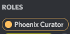
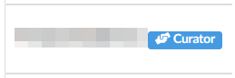

# What is a curator?

You have probably seen the "Curator" role on a few places, whether it is

* On [Discord](https://discord.gg/tosdr):\
  
* On [Phoenix](https://edit.tosdr.org):\
  
* On our [Forum](https://tosdr.community):\
  

Curators serve the same purpose as registered contributors, but with the ability to _curate_ other users’ points (not their own), create and update services, create and update documents, create and update cases and lastly create and update topics.
